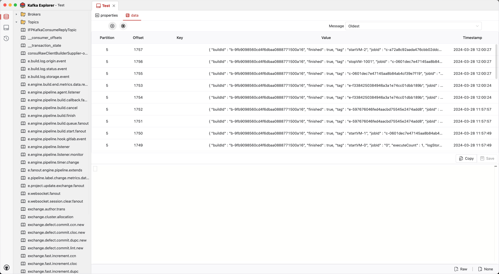
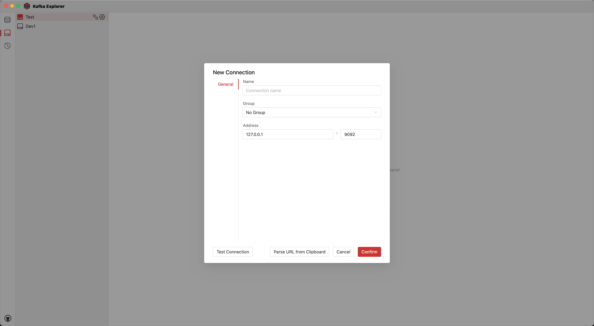

# README

## About

Kafka GUI Client


## Screenshot




## Build Guidelines

### Prerequisites

* Go (latest version)
* Node.js >= 16
* NPM >= 9

### Install Wails

```bash
go install github.com/wailsapp/wails/v2/cmd/wails@latest
```

### Pull the Code

```bash
git clone https://github.com/mqshen/KExplorer --depth=1
```

### Build Frontend

```bash
npm install --prefix ./frontend
```

### Compile and Run

```bash
wails dev
```